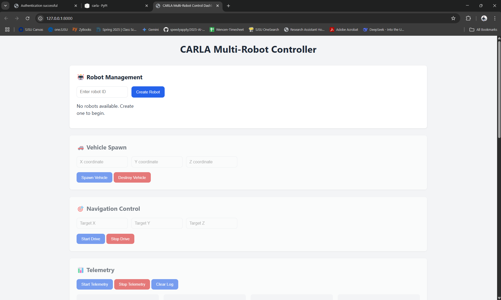
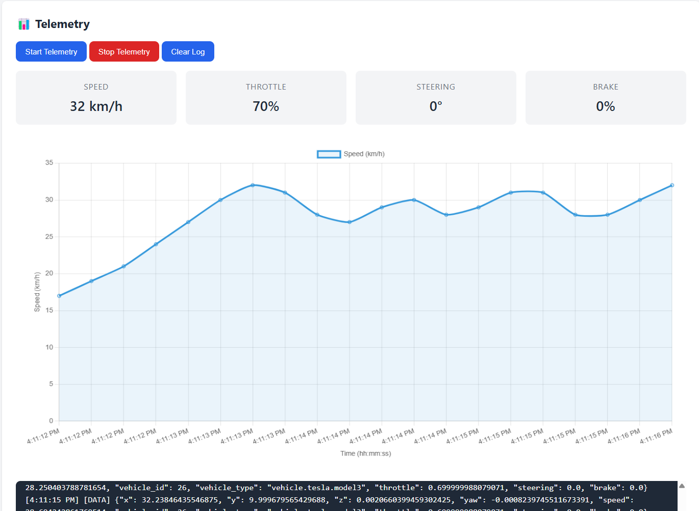

# 🚗 Carla Multi-Robot Controller with FastAPI

A modular and extensible FastAPI server designed to control and monitor multiple autonomous vehicles in the **CARLA Simulator**. This project enables real-time vehicle spawning, driving, telemetry streaming, and camera-based video feed with per-robot isolation — ideal for robotics, simulation research, and ML/AI agent integration.

---

## 🌟 Key Features

### 🔁 Multi-Robot Architecture
- Each robot has its own `CarlaController` instance managed via `robot_id`.
- Designed to scale in **multi-agent simulation environments**.

### ⚙️ FastAPI Server Interface
- Fully async REST API built with FastAPI.
- CORS-enabled for seamless integration with frontends like Streamlit or React.

### 🧭 Autonomous Navigation
- Vehicle can drive autonomously to a 3D target point.
- Waypoint-based control with basic speed and brake logic.

### 🛰 Real-Time Telemetry
- Live telemetry (position, velocity, orientation, controls) streamed via **Server-Sent Events**.

### 🎥 Camera & Streaming
- Camera can be dynamically attached to any robot.
- Real-time video streaming using MJPEG over HTTP.
- Frame-safe locking and memory-efficient buffering.

### 🧵 Modular & Threaded
- Telemetry, streaming, and driving run in isolated threads.
- Each module is independently startable/stoppable.


### Frontend For Visualization
- withfronted directory provides frontend as well for checking everything running properly.
- You can use the frontend to check the telemetry and video feed of the robot.

1. Landing Page


2. Telemetry


3. Video Feed

---

## 🚀 Quickstart

### 1. Start CARLA Simulator
Ensure the CARLA server is running on `localhost:2000`.

### 2. Install Dependencies
```
pip install fastapi uvicorn carla opencv-python numpy
```
* Remember Carla Python API is installed with the Carla simulator. You should only use wheel or egg files that comes with Carla Simulator.

### 3. Run the API Server
```
uvicorn main:app --reload
```

### 4. Use API Endpoints
```
1. Spawn: POST /robots/{robot_id}/spawn?x=...&y=...&z=...

2. Drive: POST /robots/{robot_id}/start_drive?x=...&y=...&z=...

3. Telemetry: GET /robots/{robot_id}/stream_data

4. Video Feed: GET /robots/{robot_id}/video_feed

5. Attach Camera: POST /robots/{robot_id}/attach_camera

6. Start Stream: POST /robots/{robot_id}/start_streaming
```

### 5. Example Telemetry & Video Feed

```json

{
  "x": 123.4,
  "y": 45.6,
  "z": 0.7,
  "speed": 28.5,
  "yaw": -1.3,
  "throttle": 0.5,
  "steering": 0.1,
  "brake": 0.0,
  "timestamp": "2025-04-23T12:34:56.789Z"
}
```

### 🧩 Extensibility Ideas
1. Integrate YOLO or LLM agents for detection/decision-making (Done, I will add the link here)

2. Add gRPC for inference communication with ML models (Done, I will add the link here)

3. Extend drive logic with PID controllers or RL agents (To be done)

4. Support multi-camera sensor fusion and recording (To be done)

5. I know there is a lot to improve in this Carla Simulator.


#### Caution
1. You need to make sure that the Carla server is running on localhost:2000. You can change the port in the code if you want to run it on a different port.
2. The code is not tested on Windows. It is tested on Ubuntu 20.04 and 22.04.
3. The code is not tested on Carla 0.9.15
4. Make sure port 2001 is not used by any other application. You can change the port in the code if you want to run it on a different port. 2001 port is used for streaming.
5. If you are running Carla Simulator on server. Do not forget to open port 2000 and 2001 for incoming connections.
#### Link to yolo gRPC based server

https://github.com/pratikkorat26/carlaaianalyticsserver
